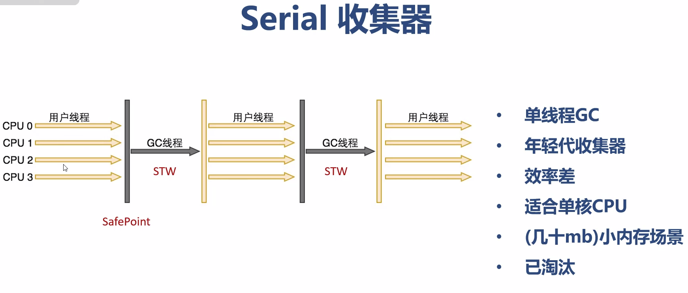
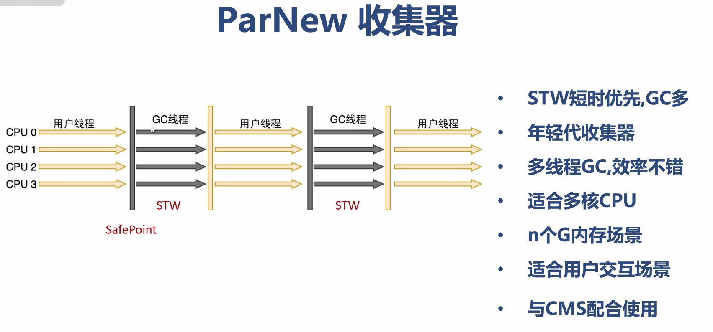
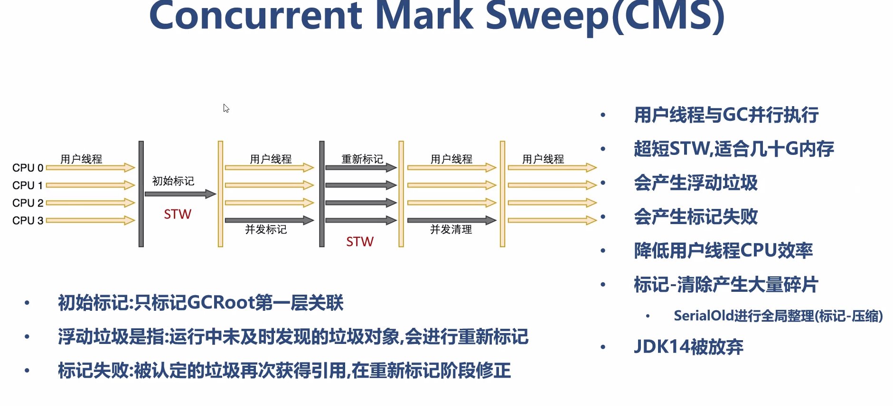
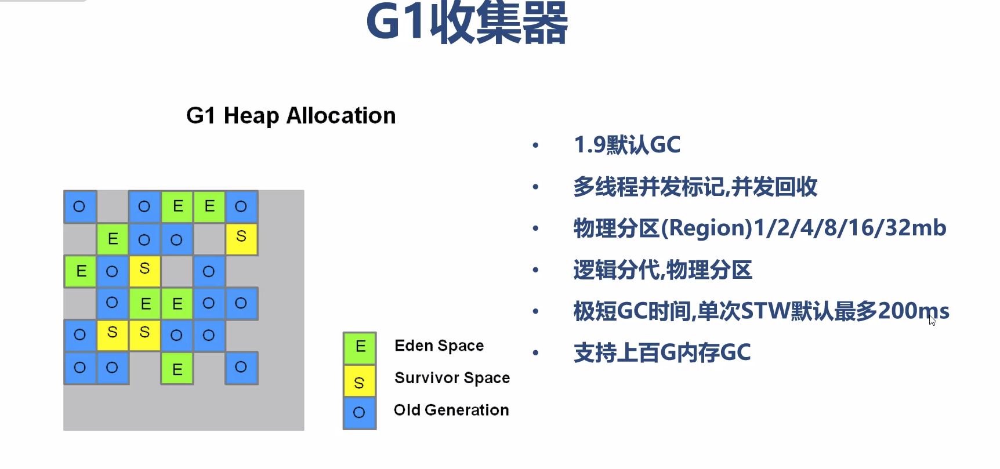
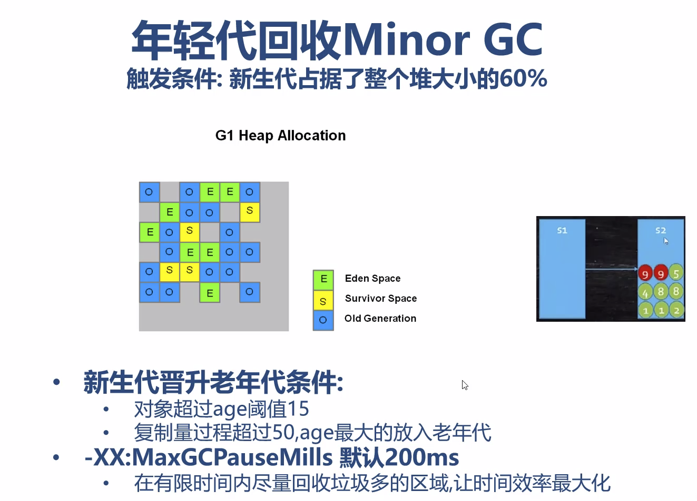
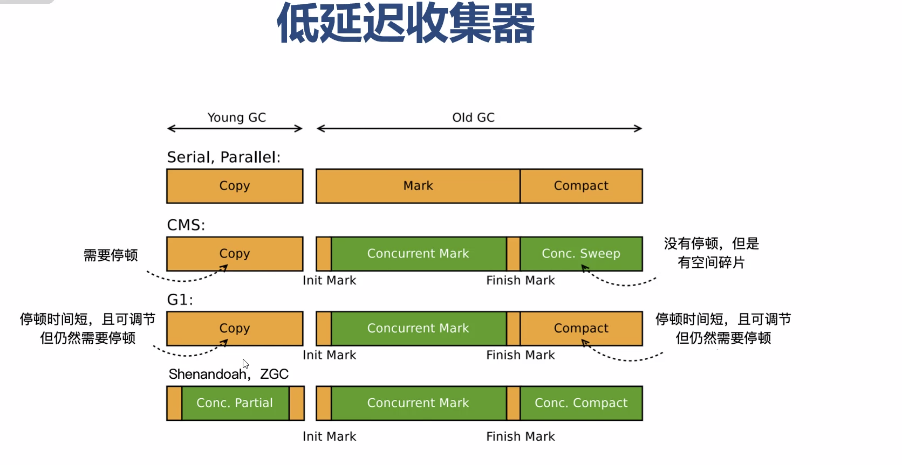
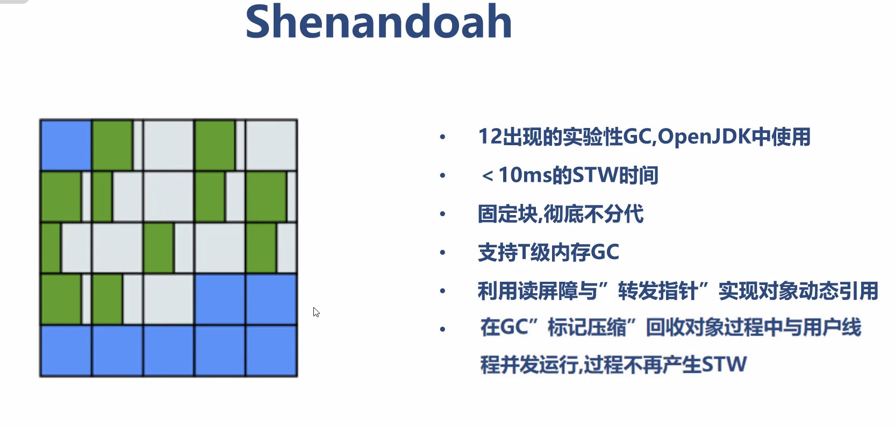

#垃圾收集GC
##对象的创建方式
```yaml
1、new 创建对象
2、反射创建对象
    .调用java.lang.Class 或者 java.lang.reflect.Construtor类似的newInstance()实例方法
3、调用对象的clone()方法
4、反序列化创建对象
    .调用java.io.ObjectInputStream对象的readObject()方法
```

## 对象如何没的：
Java自动对无用的对象进行垃圾回收、收集（Garbage Collection）释放占用的内存。

## 如何去判断一个对象是垃圾的方法
### 引用计数法（Reference Count）
实际垃圾收集器中没有被采用，因为无法解决循环引用问题

### 根搜索算法(Root Searching)[也称可达性分析算法]
从GCRoot出发，有引用的对象都是吧“不可回收的”其它可标记后再回收，是JVM默认算法。

## 垃圾回收算法
### Mark-Sweep 标记清除算法
### Copying 复制算法
### Mark-Compact 标记压缩算法

## 垃圾收集器
分代回收分类：
### 年轻代收集器
#### Serial 

#### ParNew

#### Parallel Scavenge【JDK1.8年轻代默认】

### 老年代收集器
#### Serial Old【JDK1.8老年代默认】

#### Parallel Old

#### CMS


不分代回收分类：
#### G1

G1逻辑上年轻代收集


#### ZGC 
低延时收集器【stw小于10s的收集器】



内部原理使用染色指针进行对象引用


内部原理使用读屏障和转发指针实现对象动态引用

 