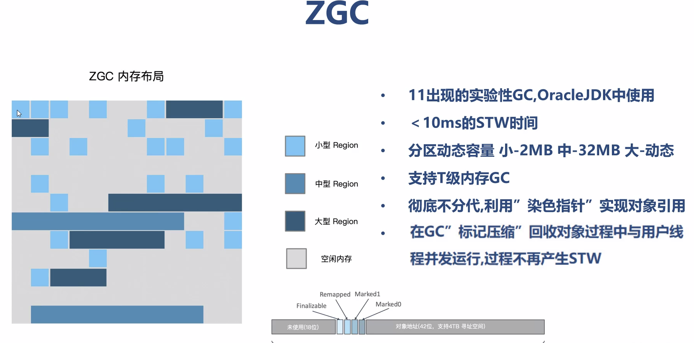
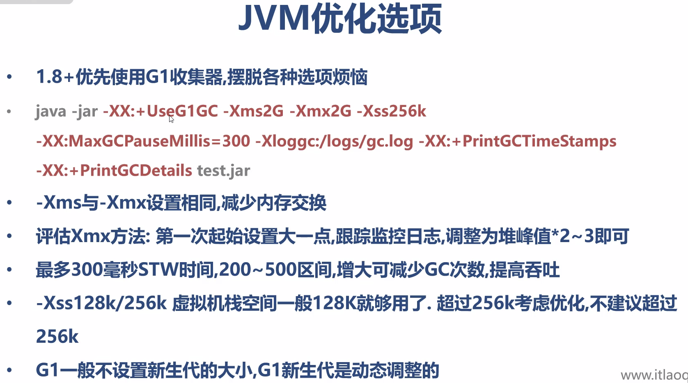
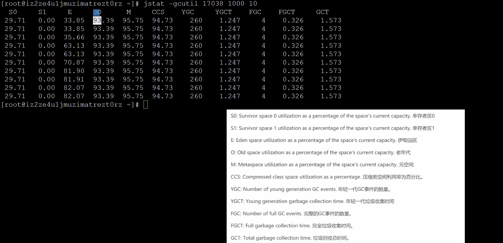

#垃圾收集GC
##对象的创建方式
```yaml
1、new 创建对象
2、反射创建对象
    .调用java.lang.Class 或者 java.lang.reflect.Construtor类似的newInstance()实例方法
3、调用对象的clone()方法
4、反序列化创建对象
    .调用java.io.ObjectInputStream对象的readObject()方法
```

## 对象如何没的：
Java自动对无用的对象进行垃圾回收、收集（Garbage Collection）释放占用的内存。

## 如何去判断一个对象是垃圾的方法
### 引用计数法（Reference Count）
实际垃圾收集器中没有被采用，因为无法解决循环引用问题

### 根搜索算法(Root Searching)[也称可达性分析算法]
从GCRoot出发，有引用的对象都是吧“不可回收的”其它可标记后再回收，是JVM默认算法。

## 垃圾回收算法
### Mark-Sweep 标记清除算法
### Copying 复制算法
### Mark-Compact 标记压缩算法

## 垃圾收集器
分代回收分类：
### 年轻代收集器
#### Serial 

#### ParNew

#### Parallel Scavenge【JDK1.8年轻代默认】

### 老年代收集器
#### Serial Old【JDK1.8老年代默认】

#### Parallel Old

#### CMS


不分代回收分类：
#### G1

G1逻辑上年轻代收集


#### ZGC 
低延时收集器【stw小于10s的收集器】



内部原理使用染色指针进行对象引用


内部原理使用读屏障和转发指针实现对象动态引用

## JVM 调优建议
大多数情况JVM生产环境考虑调整以下三个方面：
```yaml
1、最大堆和最小堆
2、GC收集器
3、新生代(年轻代)大小
```
在没有全面监控，收集性能数据之前，调优都是徒劳的。

99%的情况下都是代码出现了问题，而不是JVM参数设置得有问题[JVM内置默认的参数基本上考虑到了大多数的应用场景]



### JVM 选项规则
java -version 标准选项，任何版本JVM/任何平台都支持。
java -Xms12m 非标准选项，部分版本识别
java -XX:+PrintGCDetails 不稳定参数，不同JVM有差异，随时可能被移除。

+ 代表开启，- 代表关闭

### JVM监控命令




## 实际生产OOM问题定位
1、jps
2、jinfo、jstat辅助命令
3、arthas-阿里巴巴提供的Java诊断工具-可以实时的分析各个内存空间的分配情况
4、生成dump 文件
5、利用 visualVM本地离线分析具体每个对象的内存分配情况，定位到出问题的代码。


 