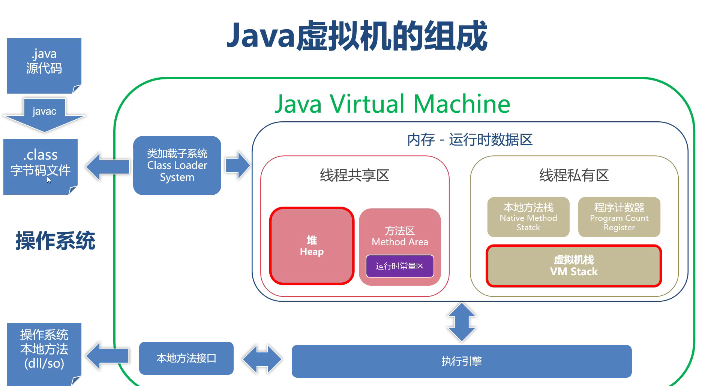
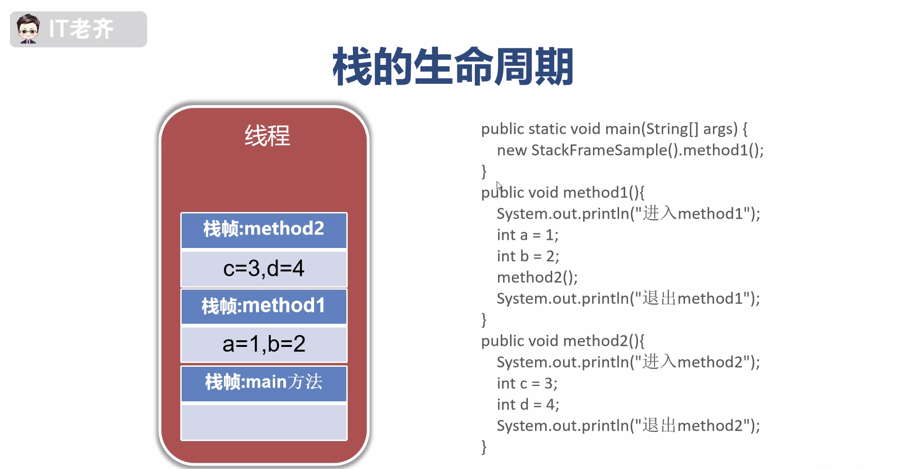

#运行时数据区

##线程私有

###程序计数器
```yaml
    1、记录当前线程执行的字节码指令的行号 
    2、每一个线程都有自己的程序计数器 
    3、执行java方法时，程序计数器有值
    4、执行native方法时，程序计数器没有值
    5、程序计数器占用的内存非常少，不会出现OutOfMemoryError
```
###虚拟机栈
[般说的栈指的就是虚拟机栈。存储Java方法调用和执行过程的数据
#### 虚拟机栈的特点
```yaml
    1、栈保存方法的调用过程
    2、栈说明了程序运行中的瞬时状态
    3、栈是线程私有的，生命周期与线程相同
    4、每次方法的调用，都会产生栈存储Java方法调用和执行过程的数据帧
    5、栈深度【栈帧的数量】是有限的
```

#### 设置虚拟机栈空间
```yaml
    1、Java1.5之后默认每个栈空间为1mb,之前版本为256k
    2、Java启动参数：-Xss 数值[k|m|g]
    3、栈分配的内存决定了栈的最大深度
```
#### 栈帧的组成部分
```yaml
    1、局部变量表 - 局部变量
    2、操作数栈 - 保存中间计算的临时结果
    3、动态链接 - 将符号引用转换为直接引用
    4、返回地址 - 存放调用方法的程序计数器值
```

###本地方法栈 - 存储本地方法的执行数据

##线程共享
###堆 - 主要存储对象

###方法区 - 存储类、方法、字段等定义（元）数据

###运行时常量区 - 保存常量 static 数据
