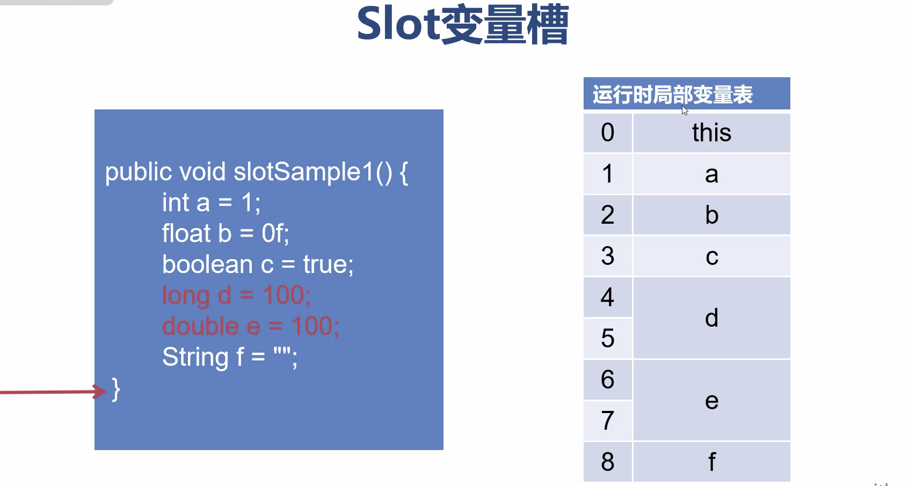
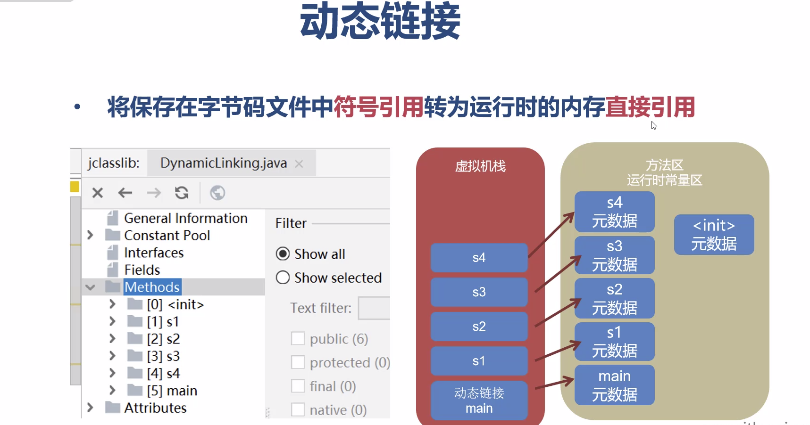
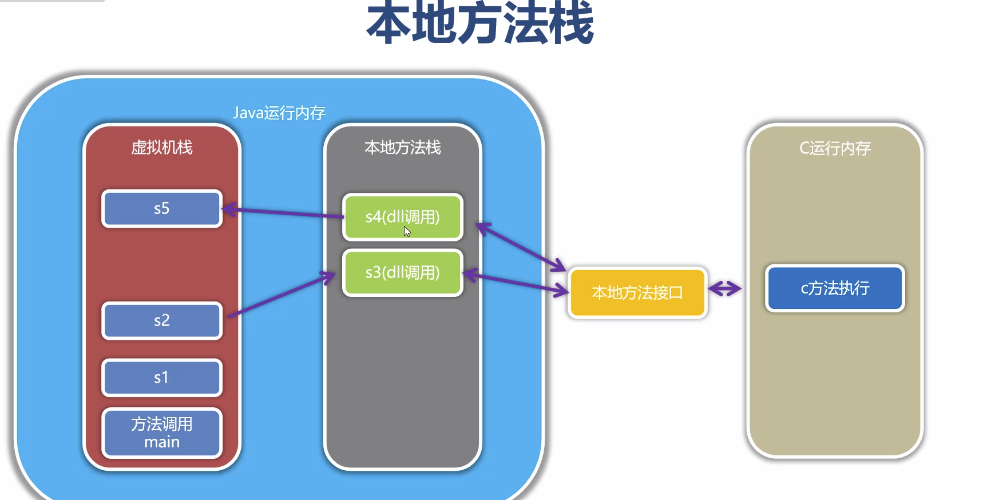
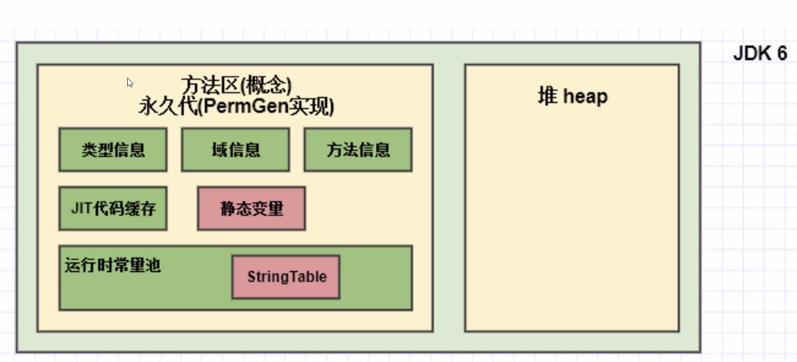
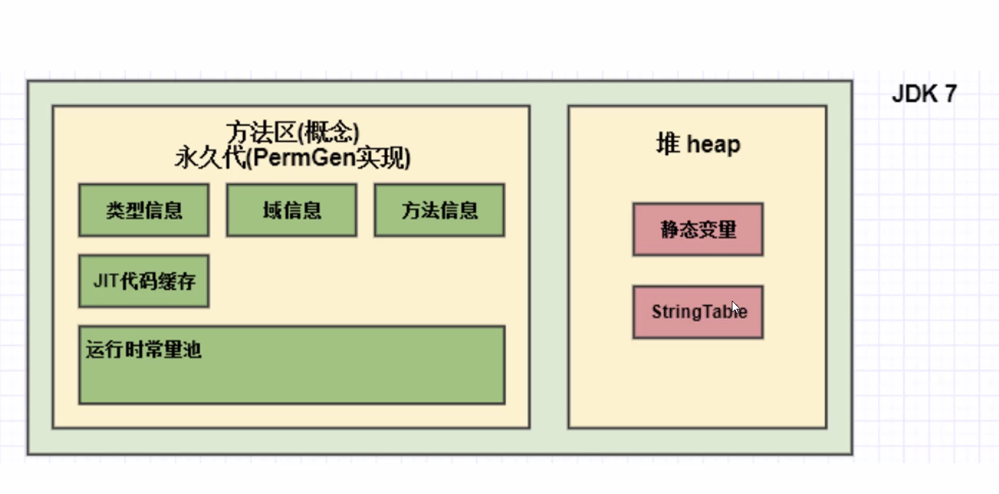
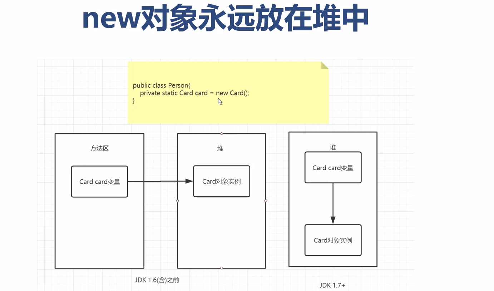

#运行时数据区

##一、线程私有

###程序计数器
```yaml
    1、记录当前线程执行的字节码指令的行号 
    2、每一个线程都有自己的程序计数器 
    3、执行java方法时，程序计数器有值
    4、执行native方法时，程序计数器没有值
    5、程序计数器占用的内存非常少，不会出现OutOfMemoryError
```
###虚拟机栈
[般说的栈指的就是虚拟机栈。存储Java方法调用和执行过程的数据
#### 虚拟机栈的特点
```yaml
    1、栈保存方法的调用过程
    2、栈说明了程序运行中的瞬时状态
    3、栈是线程私有的，生命周期与线程相同
    4、每次方法的调用，都会产生栈存储Java方法调用和执行过程的数据帧
    5、栈深度【栈帧的数量】是有限的
```

#### 设置虚拟机栈空间
```yaml
    1、Java1.5之后默认每个栈空间为1mb,之前版本为256k
    2、Java启动参数：-Xss 数值[k|m|g]
    3、栈分配的内存决定了栈的最大深度
```
#### 栈帧的组成部分
##### 局部变量表 - 局部变量
特点：
```yaml
    1、线程私有，不允许跨线程访问，随方法调用创建，方法退出销毁
    2、编译期间长度已经确定，局部变量元数据存储在字节码中
    3、局部变量表是栈帧的主要组成空间，决定了栈的深度
---> Slot变量槽：
    存储局部变量的单位称为Slot（变量槽）
    Slot按类型区分：
      32位以内类型(int/float/char/../引用类型)占用1个slot
      64位类型(long/double)占用2个slot
```

##### 操作数栈 - 保存中间计算的临时结果
字节码指令在执行过程中的中间计算过程存储在操作数栈

##### 操作数栈 - 保存中间计算的临时结果
##### 动态链接 - 将符号引用转换为直接引用

##### 返回地址 - 存放调用方法的程序计数器值
保存该方法调用者的程序计数器值，用于方法正常执行后后续继续执行。

###本地方法栈 - 存储本地方法的执行数据
本地方法：使用了native修饰的方法，具体的方法实现是其它语言进行实现的（一搬是c/c++语言实现）
本地方法特点：
```yaml
    1、一个native方法就是一个Java调用非Java代码的接口
    2、在定义一个native方法时，并不提供实现体
    3、native的可以调用其它语言的接口实现对操作系统更底层的操作
```
本地方法栈的特点：
```yaml
1、在虚拟机规范中对本地方法栈中方法使用的语言，使用方式与数据结构并没有强制的规定
2、Sun hospot 虚拟机把本地方法栈和虚拟机栈合二为一。
```

##二、线程共享
###堆[Heap] - 主要存储对象实例
特点：
```yaml
1、堆是JVM最核心的内存区域，存放运行时实例化的对象实例
2、堆在JVM启动时就被创建，空间也被分配。是JVM主要占用的内存区域
3、堆是线程共享的，堆内存在物理上是分散的，在逻辑上是连续的。
    堆中包含线程私有的缓冲区(TLAB)用于提高JVM的并发处理效率。
```


常使用参数：

      1. 设置堆空间大小的参数
         -Xms 用来设置堆空间（年轻代+老年代）的初始内存大小
         -Xmx 用来设置堆空间（年轻代+老年代）的最大内存大小
     
      2. 默认堆空间的大小
         初始内存大小：物理电脑内存大小 / 64
         最大内存大小：物理电脑内存大小 / 4
     
      3. 年轻代与老年代的占用比例:
         a. 年轻代固定占用1/3
         b. 老年代固定占用2/3
     
      4. 手动设置：-Xms1g(m) -Xmx1g(m)
         a.开发中建议将初始堆内存和最大的堆内存设置成相同的值。
         b.Java整个堆大小设置建议，Xmx 和 Xms设置为老年代FullGC后存活对象的3-4倍
         
      5、-XX：+PrintGCDetails  # 打印设置的GC参数

可视化分析工具：**visualVM**

#### 堆结构
    YGC(Young Generation Space):新生代，包括Eden、Survivor-0,Survivor-1
    Tenure Generation Space :老年代
GC日志分析：

###方法区 - 存储类、方法、字段等定义（元）数据
在《Java虚拟机规范》中说明了方法区是堆的一个逻辑部分，但在实现中，与内存无关，所以它有个名字-"非堆Non-heap"
永久代(Permanent)是JDK7(含)之前的方法区实现
    特点：
```yaml
      占用JVM内存保存数据，-XX:MaxPermSize有上限，容易内存溢出，且与其它JVM(JRocket,J9)实现不一致
```
元空间(MetaSpace)是JDK8之后的方法区实现
    特点：
```yaml
      使用本地内存(Native Memory)保存数据，最大为可用物理内存，与其它JVM保存一致。
```

设置元空间：
-XX:MetaspaceSize=xxx(M|G)
```yaml
     .设置源空间初始值，默认大小与平台相关(12mb-20mb),到达进行调整，并自动触发Full GC.
     .设置建议：一般设置为一个较大的值，减少Full GC
```
-XX:MaxMetaspaceSize=xxx(M|G)
    .设置元空间的最大值，默认为：-1,表示为最大可用物理内存，一般不设置最大值
    .超过最大值，系统则会抛出OutOfMemoryError:Metaspace
    
方法区的历史变化：
```yaml
    jdk1.6及之前： 有永久代、静态变量存放在永久代中。
    jdk1.7     :  有永久代、但已 “逐步去除永久代”，字符串常量，静态变量移除，存放在堆中
    jdk1.8及之后：  无永久代，类型信息、字段、方法、常量保存到本地内存的元空间，但字符串常量池、静态变量仍然存储在堆中  
```   



        
###运行时常量区 - 保存常量 static 数据
```yaml
    1、保存Class中的常量数据
    2、符号引用转换为直接引用[即对象指针]
    3、运行中动态产生的常量
```