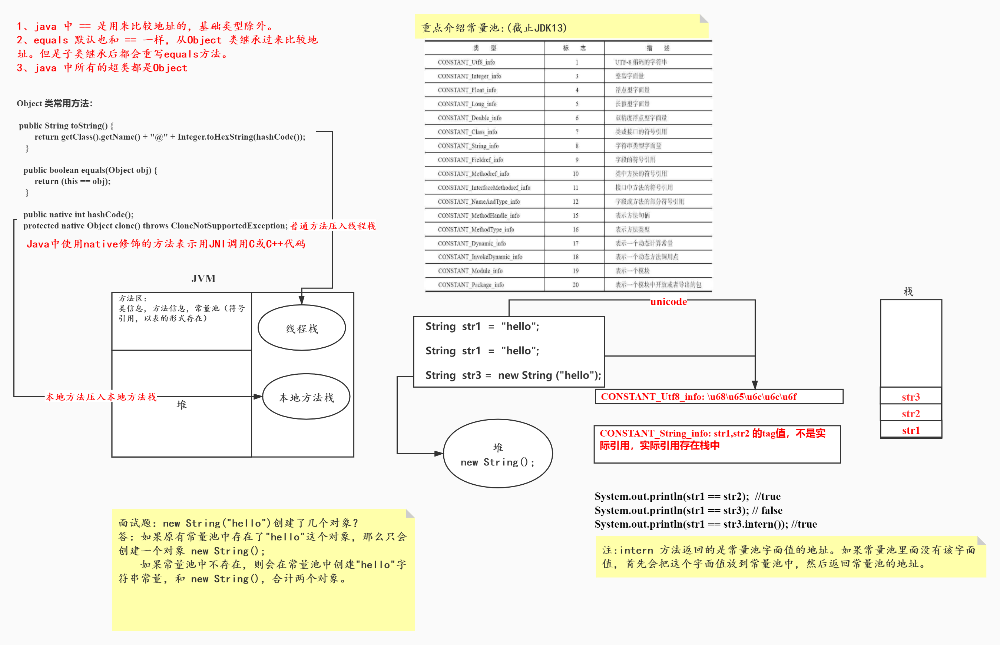
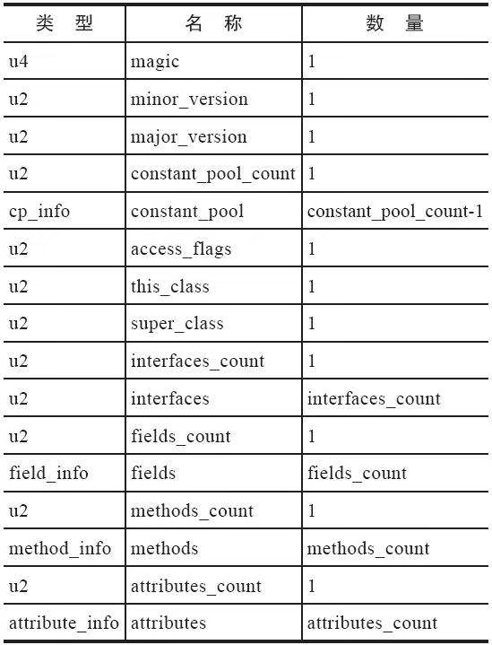
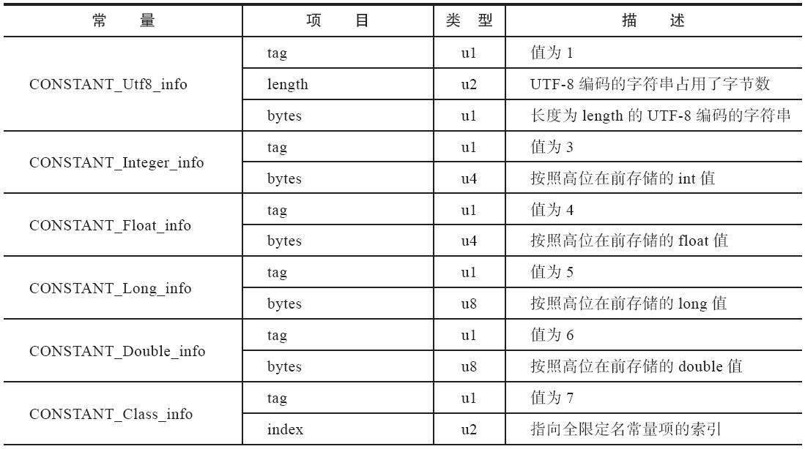
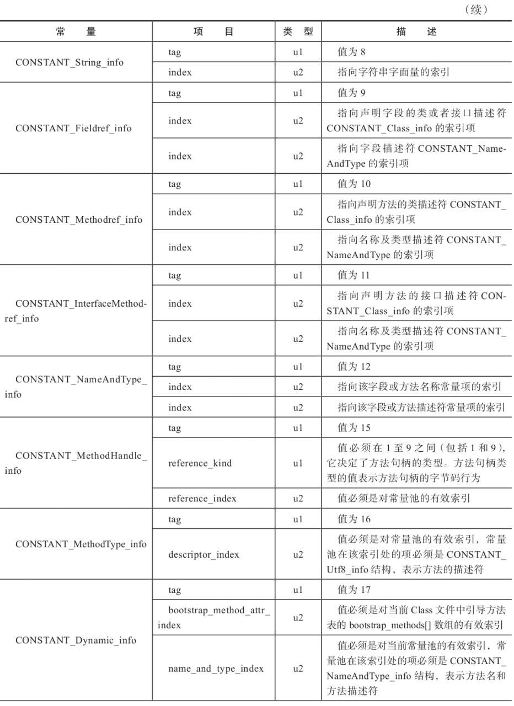
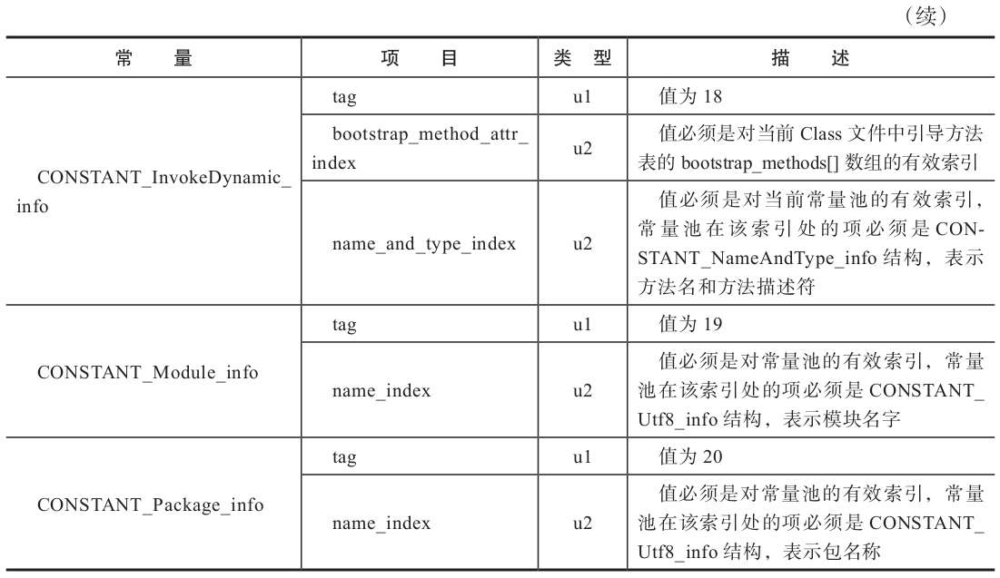

# 字节码、常量池、JVM内存管理

#

# Class 文件格式

> Class的结构不像xml等描述语言，由于它没有任何分割符号，所以在上表中的数据项，无论是在顺序还是数量，甚至于数据的字节序(Bye Ordering,class文件中的字节序为Big-Endian)这样的细节，都是严格限定的，哪个字节代表什么含义，长度是多少，先后顺序如何，全部都不允许改变。

# 常量池中17种数据类型的结构总表

