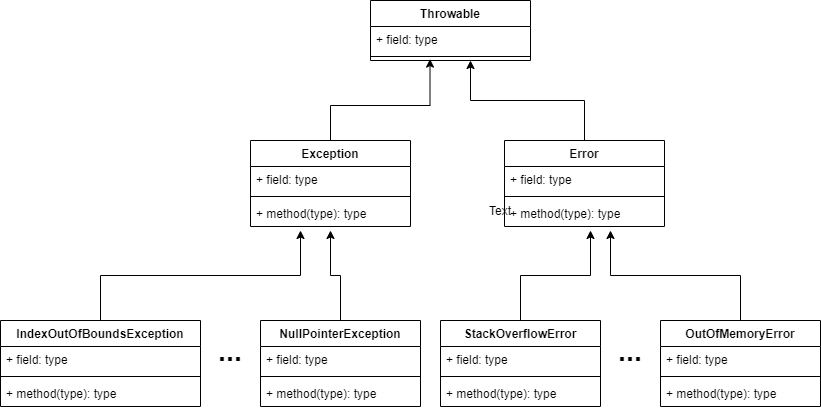

# Java 中的异常
Throwable 是所有异常的父类，他主要有两个直接子类：
## 1、Exception(类比我们国家的治安管理法)，又细分为两类：
### 1.1 检查时异常：即代码还未运行，编译器则提示需要修改后才能正常运行的异常。
### 1.2 非检查时异常[或者称为运行时异常RuntimeException]
运行时异常，常见的：NullPointerException、IllegalArgumentException、IndexOutOfBoundsException、NoSuchMethodException 等等

## 2、Error(类比我们国家的刑法)
Error 简单的理解为JVM直接报的错，非常严重，直接影响系统的正常运行。
常见的有：

OutOfMemoryError、StackOverflowError

