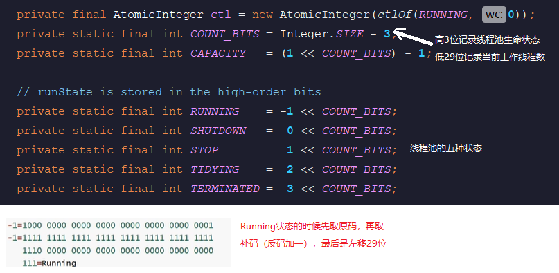
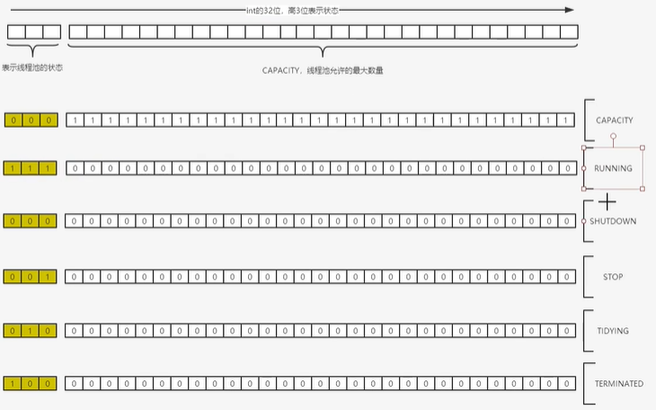

# ThreadPoolExecutor
## 线程池原理
### 线程状态
```java
    private static final int COUNT_BITS = Integer.SIZE - 3; //高3位存储线程状态，低29位当前工作线程数
    private static final int CAPACITY   = (1 << COUNT_BITS) - 1;////高3位000，低29位全为1
    // runState is stored in the high-order bits
    private static final int RUNNING    = -1 << COUNT_BITS;  //高3位111，低29位全为0
    private static final int SHUTDOWN   =  0 << COUNT_BITS;  //高3位000，低29位全为0
    private static final int STOP       =  1 << COUNT_BITS;  //高3位001，低29位全为0
    private static final int TIDYING    =  2 << COUNT_BITS;  //高3位010，低29位全为0
    private static final int TERMINATED =  3 << COUNT_BITS;  //高3位011，低29位全为0
```




## 线程池核心参数
我们查看其构造函数

```java
public class ThreadPoolExecutor extends AbstractExecutorService {
    .....
    public ThreadPoolExecutor(int corePoolSize,int maximumPoolSize,long keepAliveTime,TimeUnit unit,
            BlockingQueue<Runnable> workQueue);
 
    public ThreadPoolExecutor(int corePoolSize,int maximumPoolSize,long keepAliveTime,TimeUnit unit,
            BlockingQueue<Runnable> workQueue,ThreadFactory threadFactory);
 
    public ThreadPoolExecutor(int corePoolSize,int maximumPoolSize,long keepAliveTime,TimeUnit unit,
            BlockingQueue<Runnable> workQueue,RejectedExecutionHandler handler);
 
    public ThreadPoolExecutor(int corePoolSize,int maximumPoolSize,long keepAliveTime,TimeUnit unit,
        BlockingQueue<Runnable> workQueue,ThreadFactory threadFactory,RejectedExecutionHandler handler);
    ...
}
```

ThreadPoolExecutor 类有四个构造函数，但是通过源码我们可以看到，前面三个都最终调用了第四个构造函数，其它三个都在一定程度上采用了一些默认的参数，所以我们重点看第4个构造函数：

```java
public ThreadPoolExecutor(int corePoolSize,
                              int maximumPoolSize,
                              long keepAliveTime,
                              TimeUnit unit,
                              BlockingQueue<Runnable> workQueue,
                              ThreadFactory threadFactory,
                              RejectedExecutionHandler handler) {
        if (corePoolSize < 0 ||
            maximumPoolSize <= 0 ||
            maximumPoolSize < corePoolSize ||
            keepAliveTime < 0)
            throw new IllegalArgumentException();
        if (workQueue == null || threadFactory == null || handler == null)
            throw new NullPointerException();
        this.acc = System.getSecurityManager() == null ?
                null :
                AccessController.getContext();
        this.corePoolSize = corePoolSize;
        this.maximumPoolSize = maximumPoolSize;
        this.workQueue = workQueue;
        this.keepAliveTime = unit.toNanos(keepAliveTime);
        this.threadFactory = threadFactory;
        this.handler = handler;
    }
```

#### corePoolSize

线程池中核心线程数，默认当任务来的时候，会创建corePoolSize个线程，如果超过了这个值，会进行扩充创建线程，达到maximumPoolSize个线程数。

#### maximumPoolSize

线程池中最大线程数，线程池中最多能够创建多少个线程。

#### keepAliveTime

存活时间，表示线程没有任务执行时最多保持多久时间会终止。默认情况下，只有当线程池中的线程数大于corePoolSize时，keepAliveTime才会起作用，直到线程池中的线程数不大于corePoolSize，即当线程池中的线程数大于corePoolSize时，如果一个线程空闲的时间达到keepAliveTime，则会终止，直到线程池中的线程数不超过corePoolSize。但是如果调用了allowCoreThreadTimeOut(boolean)方法，在线程池中的线程数不大于corePoolSize时，keepAliveTime参数也会起作用，直到线程池中的线程数为0

#### unit

参数keepAliveTime的时间单位，有7种取值

```java
TimeUnit.DAYS;               //天
TimeUnit.HOURS;             //小时
TimeUnit.MINUTES;           //分钟
TimeUnit.SECONDS;           //秒
TimeUnit.MILLISECONDS;      //毫秒
TimeUnit.MICROSECONDS;      //微妙
TimeUnit.NANOSECONDS;       //纳秒
```

#### workQueue

阻塞队列，用于存储等待执行的任务。这里阻塞队列有如下几种选择：

```java
ArrayBlockingQueue;
LinkedBlockingQueue;
SynchronousQueue;
```

#### threadFactory

线程工厂，用于创建线程，可以自定义线程名称，便于定位问题。

#### handler

拒绝任务策略，用于在拒绝需要执行的任务时，采用哪种策略。可选用的策略有如下：

```java
ThreadPoolExecutor.AbortPolicy:丢弃任务并抛出RejectedExecutionException异常。 
ThreadPoolExecutor.DiscardPolicy：也是丢弃任务，但是不抛出异常。 
ThreadPoolExecutor.DiscardOldestPolicy：丢弃队列最前面的任务，然后重新尝试执行任务（重复此过程）
ThreadPoolExecutor.CallerRunsPolicy：由调用线程处理该任务 
```

